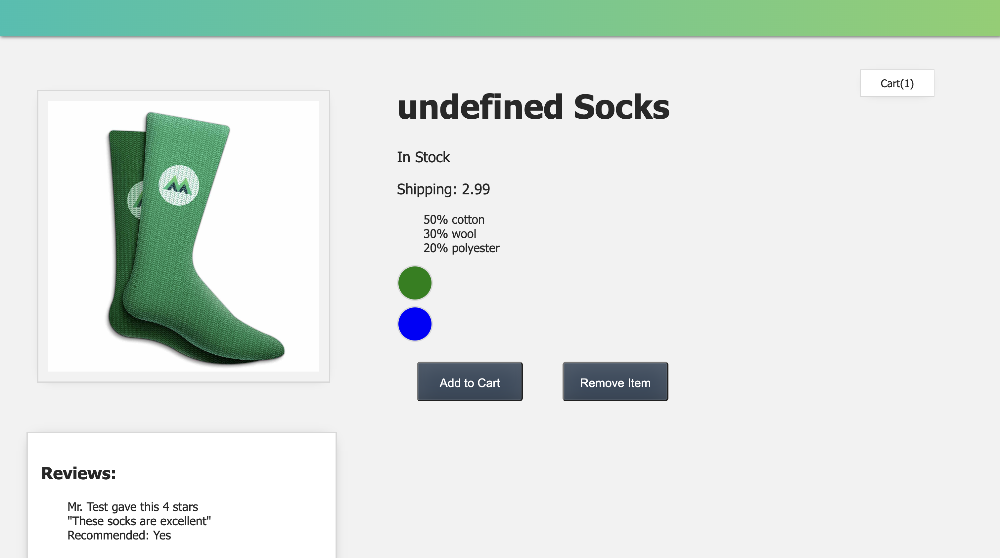

# Product-Page

### This is a Vue.js project designed for product display.

Coding along with a Vue crash tutorial.

#### product page demo

## Features

### 1. Dynamic Product Display (ProductDisplay.vue)

- Image Switching: Hovering over colour variants changes the product image.
- Inventory Check: Dynamically displays whether the product is in stock.
- Shipping Cost: Calculates shipping cost based on user type (Premium or not).

### 2. Cart Management (App.vue and ProductDisplay.vue)

- Add to Cart: Users can add items to the cart.
- Remove from Cart: Items can be removed from the cart.
- Cart Count: Dynamic display of the number of items in the cart.

### 3. User Reviews (ReviewForm.vue and ReviewList.vue)

- Review Submission: Users can submit product reviews, including name, review text, rating, and recommendation status.
- Review List: Displays a list of all submitted reviews.
- Rating: Users can rate the product on a scale of 1 to 5.
- Recommendation: Users can specify whether they would recommend the product.